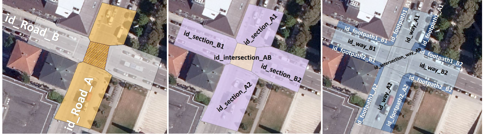

# Content
data:
- cityGML2_transportation_simpleIntersection.gml
- cityGML2_transportation_simpleIntersection_XLinks.gml
- cityGML3_transportation_simpleIntersection.gml

fme-workspaces:
- A_shape2citygml2_transportation.fmw
- B_citygml2_createXlinks.fmw
- C_citygml2tocitygml3_transportation.fmw

# Explanations 
## Workflow

## Digitization of aerial image
Street space objects are manually derived from a digital orthophoto (DOP20) and exported as .shp files using the software ArcMap10.7. The data is then transformed into several CityGML datasets. The granularity of the produced data corresponds to "way" (= CityGML2.0 LoD2).

## Generation of CityGML2.0 compliant data
First, the generated .shp objects are transformed into CityGML2.0 compliant data (A). Since CityGML2.0 does not provide a Section/Intersection concept, one CityGML2.0 Road object is generated per Section/Intersection. These Road objects consist of several TrafficAreas. The following images illustrate the data structure and also show how street space objects are assigned to different feature types in CityGML2.0 and CityGML3.0 via an instance diagram.

Another FME Workspace is used to generate CityGML2.0 Transportation data while making use of XLinks (B). The resulting .citygml file is shown below. The CityGML2.0 Road object representing Section A1 (id_section_A1) consits of 3 TrafficAreas (id_way_A1, id_footpath1_A1 and id_footpath2_A1) and stores XLinks to each of these objects.

Link to view the data: https://github.com/tum-gis/citygml3.0-transportation-examples/blob/master/Simple%20Intersection/data/cityGML2_transportation_simpleIntersection_XLinks.gml

## Transforming CityGML2.0 data to CityGML3.0 data

The first CityGML2.0 Transportation data (without XLinks) is transformed to CityGML3.0 compliant data (C). This is achieved by mapping CityGML2.0 Road objects to CityGML3.0 Sections/Intersections. These Sections/Intersection are affiliated with newly generated CityGML3.0 Road objects. 
This dataset was generated applying the general GML Writer adding the GML Application schema of CityGML3.0 as .xsd file. The GML writer however doesn’t support XLinks. Thus, the Intersection is only affiliated to Road_A. 
 
The following image shows the resulting .gml file. The proposed structure of the CityGML3.0 Transportation Model with Roads that consist of Sections/Intersections which then consist of (Auxilliary)TrafficAreas is visible.

Link to view the data:  https://github.com/tum-gis/citygml3.0-transportation-examples/blob/master/Simple%20Intersection/data/cityGML3_transportation_simpleIntersection.gml
