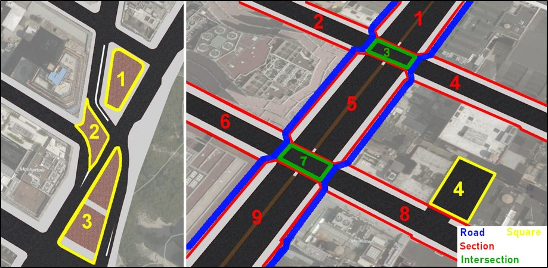

# Explanations
The CityGML2.0 street space data used to generate CityGML3.0 Transportation data can be found in the download section of the project's website: https://www.lrg.tum.de/gis/projekte/new-york-city-3d/#c1800 

The sample data represents street space objects of a 2km x 1.5km area in central Manhattan. Data transformations are realized using the software FME2019.2.

The data structure is generated according to the proposed CityGML3.0 Transportation Model. This is achieved by applying the general GML Writer adding the GML Application schema of CityGML3.0 as .xsd file. The GML writer however doesn’t support XLinks. 
The apllied segmentaion of street space into Roads (blue), Sections (red) and Intersections (green) is shown in the following image. Each Section / Intersection is further devided into individual (Auxilliary)TrafficAreas. Additionally parking lots and public plazas are represented as Squares (yellow).

The dataset contains:
* 85 Roads
* 453 Sections
* 192 Intersections
* 93 Squares
* 1309 AuxilliaryTrafficAreas
* 1869 Traffic Areas
