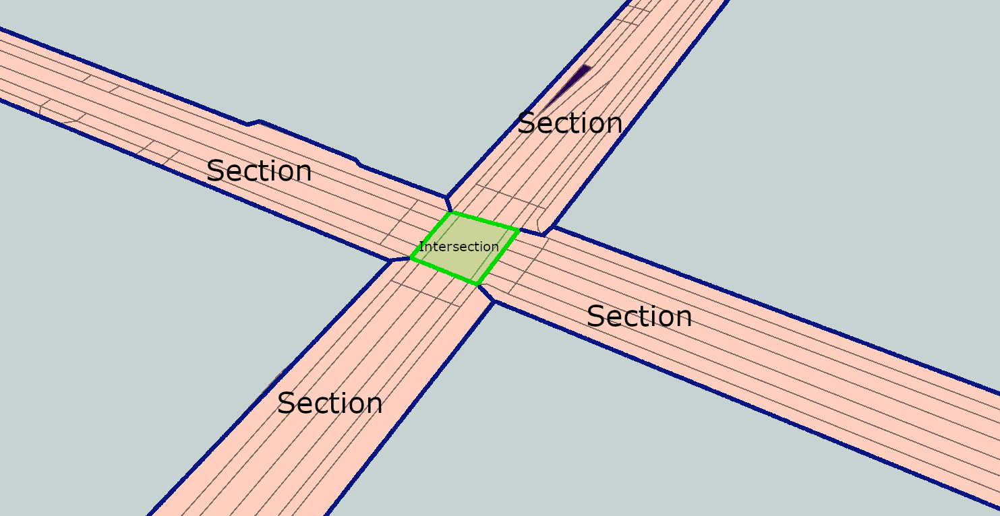

# TUM CityGML 3.0 Transportation example
A CityGML3.0 Transportation sample dataset of an intersection near TU Munich. Including Roads, Sections, Intersections, TrafficAreas and AuxiliaryTrafficAreas.

The streetspace objects are manually derived from a digital orthophoto (DOP20) and exported as .shp files using the software ArcMap10.7. The data is then transformed into several CityGML datasets. The granularity of the produced data corresponds to "lane" (= CityGML2.0 LoD3).

The structure of the data is displayed in the following image

